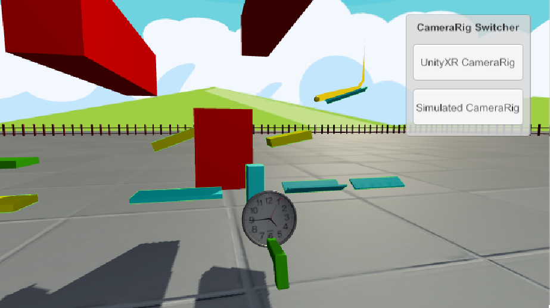

# VirtualSandbox
A VR physics-based sandbox where you modify the environment to accomplish goals.

This is an WIP project currently with a few levels that include moving platforms with your hands to navigate a ball to the target goal. You can resize platforms and use their special properties to your advantage. Use the Time Gun to start and reset time.

Required Dependencies: PostProcessing, ProCore, Standard Assets, SteamVR, VRTK

